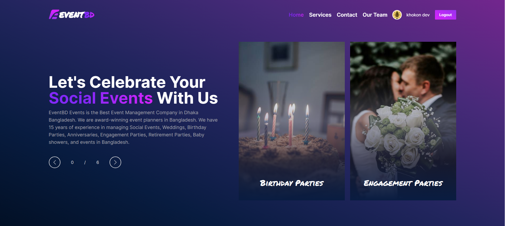

<h2 align="center">
  EventBD - Social Events Provider 
  <a href="https://eventbd-499fc.web.app" target="_blank">Demo Link - - -</a>
</h2>

  

<h2 align="center">
 
 
 Project features 

</h2>

- **_User Registration:_** Users can create account by providing their email and password.
- **_User Sign in:_** Users can Sign in by providing their email and password
- **_Google Authentication:_** Google Authentication options
- **_User Logout:_** Implement a logout
- **_Authentication State Management:_** Manage the user's authentication state using Firebase's onAuthStateChanged method. This allows you to determine if a user is authenticated and retrieve their information.
- **_Private and Public Routing:_** Manage a public and private routes using react-router-dom
- **_Contact:_** Contact Option
- **_Service section:_** Display our service
- **_Team section:_** Display our team members details
- **_Service Details:_** Display Service details
